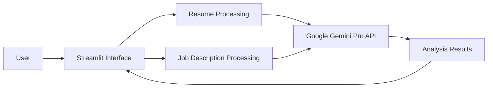

"End-To-End Resume ATS Tracking LLM Project With Google Gemini Pro":

---

# Project Documentation: Resume ATS Tracking LLM Project with Google Gemini Pro

## Table of Contents
1. [Introduction](#introduction)
2. [Project Overview](#project-overview)
3. [System Architecture](#system-architecture)
4. [Installation Guide](#installation-guide)
5. [Usage Instructions](#usage-instructions)
6. [Features and Functionalities](#features-and-functionalities)
7. [API Integration](#api-integration)
8. [Testing and Validation](#testing-and-validation)
9. [Future Enhancements](#future-enhancements)
10. [Contributing Guidelines](#contributing-guidelines)
11. [License](#license)
12. [Contact Information](#contact-information)

## Introduction
The "Resume ATS Tracking LLM Project with Google Gemini Pro" is designed to revolutionize the hiring process by leveraging advanced AI models. The system analyzes resumes and job descriptions, providing recruiters with insights into how well a candidate’s resume aligns with the job requirements. The key features include job description matching, identification of missing keywords, and generation of a profile summary.

## Project Overview
### Purpose
The primary goal of this project is to streamline the recruitment process by automating the evaluation of resumes against job descriptions. This helps recruiters quickly identify the most suitable candidates, saving time and effort.

### Scope
The system is intended for use by recruiters and HR professionals. It can be integrated into existing Applicant Tracking Systems (ATS) or used as a standalone tool. The project also serves as a learning resource for developers interested in AI, NLP, and resume analysis.

### Technology Stack
- **Language**: Python 3.10
- **Framework**: Streamlit for web interface
- **AI Model**: Google Gemini Pro for natural language processing
- **APIs**: Google Gemini Pro API for model integration

## System Architecture
### High-Level Architecture
The system architecture consists of the following components:
1. **User Interface (UI)**: Built using Streamlit, allowing users to input job descriptions and resumes.
2. **Backend Processing**: Handles data preprocessing, API calls to the Gemini Pro model, and analysis.
3. **Output Generation**: Provides the user with a match score, missing keywords, and a profile summary.

### Data Flow Diagram


## Installation Guide
### Prerequisites
- Python 3.10 or higher installed on your system.
- Google Gemini Pro API credentials.

### Installation Steps
1. **Clone the Repository**:
   ```bash
   git clone https://github.com/dcsgod/ATS-Optimized-Resume-Analyzer-using-Gemini-Model
   cd ATS-Optimized-Resume-Analyzer-using-Gemini-Model
   ```
2. **Install Dependencies**:
   ```bash
   pip install -r requirements.txt
   ```
3. **Set Up API Credentials**:
   - Create a `.env` file in the project root.
   - Add your Google Gemini Pro API key:
     ```bash
     GOOGLE_API_KEY= "your_api_key"
     ```

## Usage Instructions
### Running the Application
1. **Start the Streamlit App**:
   ```bash
   streamlit run app.py
   ```
2. **Access the Application**:
   - Open your web browser and go to `http://localhost:5000`.
3. **Input Data**:
   - Enter the job description and candidate’s resume in the respective fields.
4. **Submit for Analysis**:
   - Click on the "Submit" button to start the analysis.
5. **View Results**:
   - Review the job description match score, missing keywords, and generated profile summary.

## Features and Functionalities
### Job Description Match
- **Purpose**: Evaluates how closely a candidate’s resume aligns with the job description.
- **Output**: A match score that indicates the percentage of alignment.

### Missing Keywords
- **Purpose**: Identifies essential keywords or skills missing from the resume that are required by the job description.
- **Output**: A list of missing keywords or skills.

### Profile Summary
- **Purpose**: Generates a concise summary of the candidate’s key strengths and qualifications based on their resume.
- **Output**: A short paragraph highlighting the candidate's suitability for the role.

## API Integration
### Google Gemini Pro API
- **Authentication**: API key-based authentication.
- **Endpoints**:
  - Resume analysis
  - Job description processing
- **Data Format**: JSON requests and responses.
- **Error Handling**: Implements error handling for API call failures, including retry mechanisms and informative error messages.

## Testing and Validation
### Test Cases
- **Unit Tests**: Test individual functions for data processing, API integration, and output generation.
- **Integration Tests**: Ensure that different components of the system work seamlessly together.
- **User Acceptance Testing (UAT)**: Validate the system with real-world data to ensure it meets user expectations.

### Validation Strategy
- **Benchmarking**: Compare the output of the system with manual evaluations to ensure accuracy.
- **Performance Testing**: Measure the response time of the system, particularly the time taken for API calls and output generation.

## Future Enhancements
- **Multi-Language Support**: Extend the system to support resumes and job descriptions in multiple languages.
- **Integration with Other ATS**: Develop plugins to integrate the system with popular ATS platforms like Workday or Greenhouse.
- **Advanced Reporting**: Provide detailed analytics on candidate pools, including trend analysis and diversity insights.

## Contributing Guidelines
1. **Fork the Repository**: Create a fork of the repository on GitHub.
2. **Create a New Branch**: For your feature or bug fix.
3. **Make Changes**: Implement your feature or fix and test thoroughly.
4. **Submit a Pull Request**: Provide a clear description of your changes and submit a pull request for review.

## License
This project is licensed under the MIT License. You can freely use, modify, and distribute the software under the terms of the license.

## Contact Information
If you have any questions or need support, feel free to reach out to the project maintainer:

- **Maintainer**: Ravi Kumar
- **Email**: rk9128557489@gmail.com

Happy recruiting with Gemini Pro ATS!

---

Made with ❤️ Ravi Kumar 